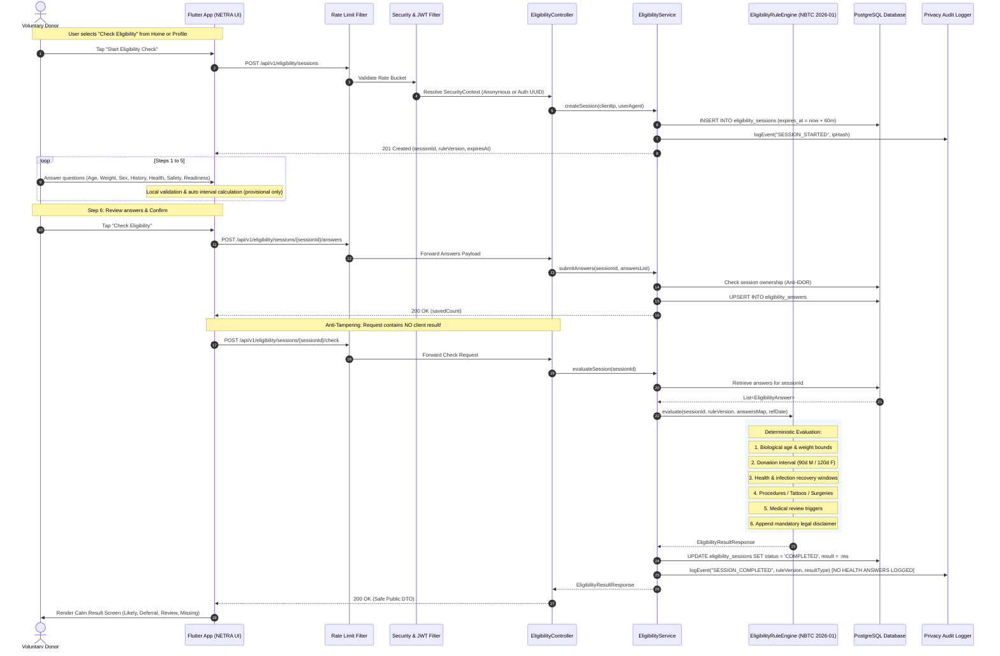
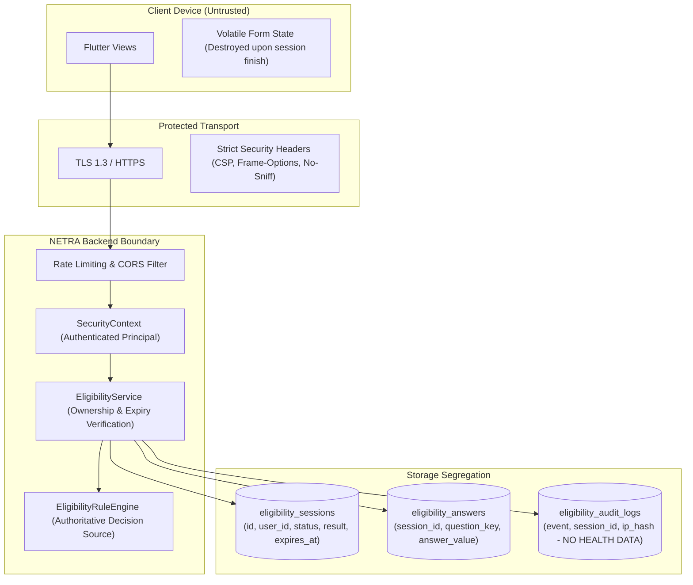

# NETRA Pre-Screening Data Flow & Architecture

## 1. End-to-End Data Flow Sequence

```mermaid
sequenceDiagram
    autonumber
    actor Donor as Voluntary Donor
    participant Flutter as Flutter App (NETRA UI)
    participant RateLimiter as Rate Limit Filter
    participant Security as Security & JWT Filter
    participant Controller as EligibilityController
    participant Service as EligibilityService
    participant Engine as EligibilityRuleEngine (NBTC 2026-01)
    participant DB as PostgreSQL Database
    participant Audit as Privacy Audit Logger

    Note over Donor,Flutter: User selects "Check Eligibility" from Home or Profile
    Donor->>Flutter: Tap "Start Eligibility Check"
    Flutter->>RateLimiter: POST /api/v1/eligibility/sessions
    RateLimiter->>Security: Validate Rate Bucket
    Security->>Controller: Resolve SecurityContext (Anonymous or Auth UUID)
    Controller->>Service: createSession(clientIp, userAgent)
    Service->>DB: INSERT INTO eligibility_sessions (expires_at = now + 60m)
    Service->>Audit: logEvent("SESSION_STARTED", ipHash)
    Service-->>Flutter: 201 Created (sessionId, ruleVersion, expiresAt)

    loop Steps 1 to 5
        Donor->>Flutter: Answer questions (Age, Weight, Sex, History, Health, Safety, Readiness)
        Note over Flutter: Local validation & auto interval calculation (provisional only)
    end

    Note over Donor,Flutter: Step 6: Review answers & Confirm
    Donor->>Flutter: Tap "Check Eligibility"
    Flutter->>RateLimiter: POST /api/v1/eligibility/sessions/{sessionId}/answers
    RateLimiter->>Controller: Forward Answers Payload
    Controller->>Service: submitAnswers(sessionId, answersList)
    Service->>DB: Check session ownership (Anti-IDOR)
    Service->>DB: UPSERT INTO eligibility_answers
    Service-->>Flutter: 200 OK (savedCount)

    Note over Flutter,Controller: Anti-Tampering: Request contains NO client result!
    Flutter->>RateLimiter: POST /api/v1/eligibility/sessions/{sessionId}/check
    RateLimiter->>Controller: Forward Check Request
    Controller->>Service: evaluateSession(sessionId)
    Service->>DB: Retrieve answers for sessionId
    DB-->>Service: List<EligibilityAnswer>
    Service->>Engine: evaluate(sessionId, ruleVersion, answersMap, refDate)
    
    rect rgb(240, 248, 255)
        Note over Engine: Deterministic Evaluation:
        Note over Engine: 1. Biological age & weight bounds
        Note over Engine: 2. Donation interval (90d M / 120d F)
        Note over Engine: 3. Health & infection recovery windows
        Note over Engine: 4. Procedures / Tattoos / Surgeries
        Note over Engine: 5. Medical review triggers
        Note over Engine: 6. Append mandatory legal disclaimer
    end

    Engine-->>Service: EligibilityResultResponse
    Service->>DB: UPDATE eligibility_sessions SET status = 'COMPLETED', result = :res
    Service->>Audit: logEvent("SESSION_COMPLETED", ruleVersion, resultType) [NO HEALTH ANSWERS LOGGED]
    Service-->>Controller: EligibilityResultResponse
    Controller-->>Flutter: 200 OK (Safe Public DTO)

    Flutter->>Donor: Render Calm Result Screen (Likely, Deferral, Review, Missing)
```

## 2. Zero-Trust Data Isolation Architecture

```mermaid
graph TD
    subgraph ClientBoundary["Client Device (Untrusted)"]
        UI["Flutter Views"]
        Draft["Volatile Form State (Destroyed upon session finish)"]
    end

    subgraph Transport["Protected Transport"]
        TLS["TLS 1.3 / HTTPS"]
        Headers["Strict Security Headers (CSP, Frame-Options, No-Sniff)"]
    end

    subgraph ServiceLayer["NETRA Backend Boundary"]
        Gateway["Rate Limiting & CORS Filter"]
        SecCtx["SecurityContext (Authenticated Principal)"]
        Svc["EligibilityService (Ownership & Expiry Verification)"]
        Eng["EligibilityRuleEngine (Authoritative Decision Source)"]
    end

    subgraph Persistence["Storage Segregation"]
        SessTable[("eligibility_sessions<br/>(id, user_id, status, result, expires_at)")]
        AnsTable[("eligibility_answers<br/>(session_id, question_key, answer_value)")]
        AuditTable[("eligibility_audit_logs<br/>(event, session_id, ip_hash - NO HEALTH DATA)")]
    end

    UI --> TLS
    TLS --> Gateway
    Gateway --> SecCtx
    SecCtx --> Svc
    Svc --> Eng
    Svc --> SessTable
    Svc --> AnsTable
    Svc --> AuditTable
```
