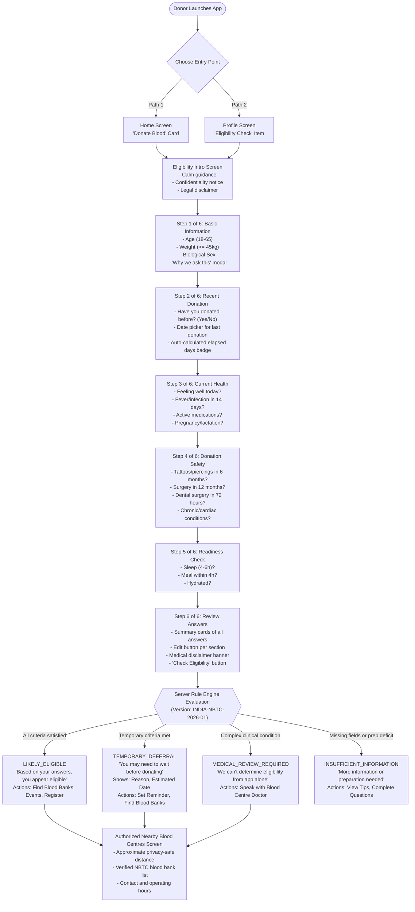

# NETRA Pre-Screening UX Flow Diagram

```mermaid
flowchart TD
    Start(["Donor Launches App"]) --> Entry{"Choose Entry Point"}
    Entry -->|Path 1| Home["Home Screen<br/>'Donate Blood' Card"]
    Entry -->|Path 2| Profile["Profile Screen<br/>'Eligibility Check' Item"]

    Home --> Intro["Eligibility Intro Screen<br/>- Calm guidance<br/>- Confidentiality notice<br/>- Legal disclaimer"]
    Profile --> Intro

    Intro --> Step1["Step 1 of 6: Basic Information<br/>- Age (18-65)<br/>- Weight (>= 45kg)<br/>- Biological Sex<br/>- 'Why we ask this' modal"]

    Step1 --> Step2["Step 2 of 6: Recent Donation<br/>- Have you donated before? (Yes/No)<br/>- Date picker for last donation<br/>- Auto-calculated elapsed days badge"]

    Step2 --> Step3["Step 3 of 6: Current Health<br/>- Feeling well today?<br/>- Fever/infection in 14 days?<br/>- Active medications?<br/>- Pregnancy/lactation?"]

    Step3 --> Step4["Step 4 of 6: Donation Safety<br/>- Tattoos/piercings in 6 months?<br/>- Surgery in 12 months?<br/>- Dental surgery in 72 hours?<br/>- Chronic/cardiac conditions?"]

    Step4 --> Step5["Step 5 of 6: Readiness Check<br/>- Sleep (4-6h)?<br/>- Meal within 4h?<br/>- Hydrated?"]

    Step5 --> Step6["Step 6 of 6: Review Answers<br/>- Summary cards of all answers<br/>- Edit button per section<br/>- Medical disclaimer banner<br/>- 'Check Eligibility' button"]

    Step6 --> Evaluator{{"Server Rule Engine Evaluation<br/>(Version: INDIA-NBTC-2026-01)"}}

    Evaluator -->|All criteria satisfied| R1["LIKELY_ELIGIBLE<br/>'Based on your answers, you appear eligible'<br/>Actions: Find Blood Banks, Events, Register"]
    Evaluator -->|Temporary criteria met| R2["TEMPORARY_DEFERRAL<br/>'You may need to wait before donating'<br/>Shows: Reason, Estimated Date<br/>Actions: Set Reminder, Find Blood Banks"]
    Evaluator -->|Complex clinical condition| R3["MEDICAL_REVIEW_REQUIRED<br/>'We can't determine eligibility from app alone'<br/>Actions: Speak with Blood Centre Doctor"]
    Evaluator -->|Missing fields or prep deficit| R4["INSUFFICIENT_INFORMATION<br/>'More information or preparation needed'<br/>Actions: View Tips, Complete Questions"]

    R1 --> Nearby["Authorized Nearby Blood Centres Screen<br/>- Approximate privacy-safe distance<br/>- Verified NBTC blood bank list<br/>- Contact and operating hours"]
    R2 --> Nearby
    R3 --> Nearby
```
